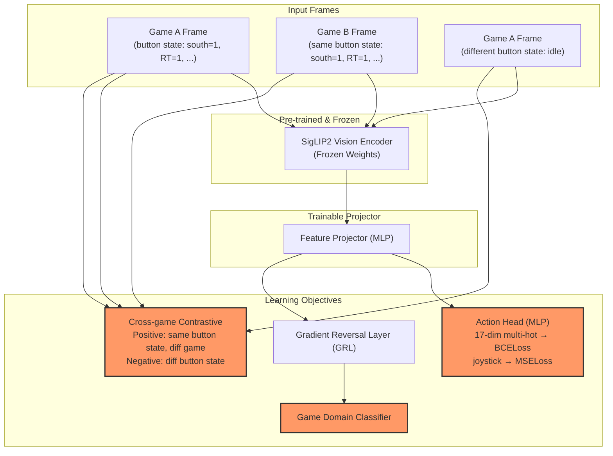

## 연구 개요

### 문제 정의

**Cross-game Action-Predictive Representation Learning**

게임마다 시각적 스타일(아트, 조명, UI)이 다르지만, 컨트롤러 버튼 입력은 게임 전체에서 동일한 17버튼 레이아웃을 공유한다. 이 구조를 활용해 다음 문제를 정의한다.

> *게임 도메인(아트 스타일, UI, 분위기)에 독립적으로, 시각 프레임으로부터 컨트롤러 입력 패턴을 예측할 수 있는 Vision Encoder를 학습할 수 있는가?*

학습에 사용하지 않은 새로운 게임에서도 버튼 입력을 예측할 수 있다면, 해당 Encoder는 게임 종류에 관계없이 범용적인 행동 표현을 내재화했다고 볼 수 있다.

### 기여

1. **문제 정의 및 벤치마크**: Cross-game action-predictive representation learning을 공식 문제로 정의하고, NitroGen 기반의 재현 가능한 평가 프로토콜을 제안
2. **제안 방법**: GRL(도메인 억압) + Cross-game Contrastive(액션 유사성 당기기)를 결합한 학습 프레임워크

Vision Encoder는 인공지능이 시각적 정보를 '이해'할 수 있도록 돕는 핵심 부품으로,
쉽게 비유하자면 **사람의 눈으로 본 이미지를 컴퓨터가 읽을 수 있는 언어(숫자 데이터)로 번역해주는 통번역가**라고 할 수 있다.

## 1) 연구 가설 (검증 가능한 형태)

**가설 H1**
GRL + Cross-game Contrastive를 결합한 Vision Encoder는, GRL 단독 및 기본 SIGLIP2 대비 hold-out 게임에서의 컨트롤러 입력 예측 성능(Button-wise F1)을 유의미하게 향상시킨다.

**가설 H2**
GRL + Cross-game Contrastive를 적용한 Encoder의 임베딩 공간은, 게임 ID 기반 분리도가 감소하고 버튼 입력 패턴 기반 클러스터링이 강화된다.

**가설 H3 (ablation)**
GRL과 Cross-game Contrastive는 각각 독립적으로 일반화에 기여하며, 두 신호를 결합했을 때 상호 보완적 효과가 나타난다.

그렇다면 현재 Vision Encoder는 어떻게 게임 이미지를 이해하고 있는가?
임베딩된 벡터는 어떤 데이터를 담고 있는가?

SIGLIP2 모델을 가지고 게임 이미지를 저차원 시각화 (t-SNE / UMAP)를 진행했다.

> [!NOTE] 왜 SIGLIP2 모델인가?
> 최근 NVIDIA에서 게임 플레이 기반 파운데이션 모델을 발표했고, 해당 계열에서 SIGLIP2가 Vision Encoder로 활용되었다.


```
MODEL_ID = "google/siglip2-so400m-patch14-384"
DATASET_ID = "Bingsu/Gameplay_Images"
N_PER_CLASS = 200  # 게임당 샘플링 개수
SEED = 42
BATCH_SIZE = 32
```

게임 별로 분류가 되어 있는 것을 확인했고, 현재 Vision Encoder는 게임의 아트 스타일과 분위기 환경의 영향을 주로 받고 있다.

그렇다면 Nitrogen에서 사용한 SIGLIP2 모델은?
Nitrogen에서는 게임 비디오의 Action 데이터를 매핑하여 새롭게 Vision Encoder를 학습하게 만들었다. 즉, Nitrogen의 Vision Encoder는 액션을 중심으로 대조학습이 이뤄졌고, 게임의 스타일, 분위기, 환경보다는 게임 내 액션에 따라 분류가 진행된다.

## Ground Truth 설계

NitroGen 데이터셋(`nvidia/NitroGen`)은 30,000개 게임 비디오에 대해 **프레임 단위 컨트롤러 입력**이 주석 처리되어 있다.

- `actions_raw.parquet`: 1행 = 1프레임의 게임패드 상태
- 17개 boolean 버튼 (`south(A)`, `east(B)`, `left_trigger`, `right_trigger` 등) + 아날로그 스틱 (j_left, j_right)
- `actions_processed.parquet`는 IDLE 프레임이 제거되어 있으므로, 로딩/타이틀/대화 구간을 포함하려면 **`actions_raw.parquet` 기준**으로 사용

이 구조 덕분에 수동 라벨링 없이 **17차원 multi-hot 벡터가 곧 Action의 Ground Truth**가 된다.
모든 게임이 동일한 컨트롤러 레이아웃을 사용하므로, 라벨 공간이 게임 전체에서 통일되어 있다.


## 도메인 라벨 정의 (GRL 입력)

GRL에서 제거할 도메인 정보는 아래처럼 명시한다.

| 도메인 축 | 예시 라벨 | 목적 | 라벨 출처 |
|---|---|---|---|
| 게임 ID | game_a, game_b, ... | 게임별 고유 UI/아트 편향 제거 | NitroGen metadata.json |
| 장르 | platformer, action-rpg, fps | 장르별 시각 패턴 편향 완화 | NitroGen metadata.json |

초기 실험은 `게임 ID`부터 시작하고, 필요 시 `장르` 축을 추가한다.
시각 테마/렌더링 품질은 자동 라벨링 수단이 없어 제외한다.

그럼 검증은 어떻게?
저차원 시각화는 보조 진단으로만 사용하고, 정량 지표를 주 평가로 사용한다.

## 평가 설계

비교군:
- Baseline A: 원본 SIGLIP2 (frozen, no adaptation)
- Baseline B: Nitrogen SIGLIP2 (action-trained, no GRL)
- Ablation C: SIGLIP2 + GRL only
- Ablation D: SIGLIP2 + Cross-game Contrastive only
- **Proposed**: SIGLIP2 + GRL + Cross-game Contrastive


Architecture



## 데이터 전략

**학습 데이터**: NitroGen `actions_raw.parquet`
- IDLE 포함 버전으로 로딩/타이틀/대화 구간도 학습에 반영
- 학습 게임: 시각 스타일과 장르가 다양한 5~6개 게임

**Hold-out (검증 데이터)**: 학습에 사용하지 않은 2~3개 게임
- 동일 데이터셋 내에서 게임 ID 기준으로 분리
- 학습 게임과 다른 시각 스타일의 게임을 우선 선택

**평가 지표**:
- In-domain: 학습 게임 내 버튼 예측 성능 (Button-wise F1)
- Out-of-domain: Hold-out 게임 버튼 예측 성능
- GRL 없을 때 vs GRL 있을 때 Out-of-domain 성능 Gap이 핵심
