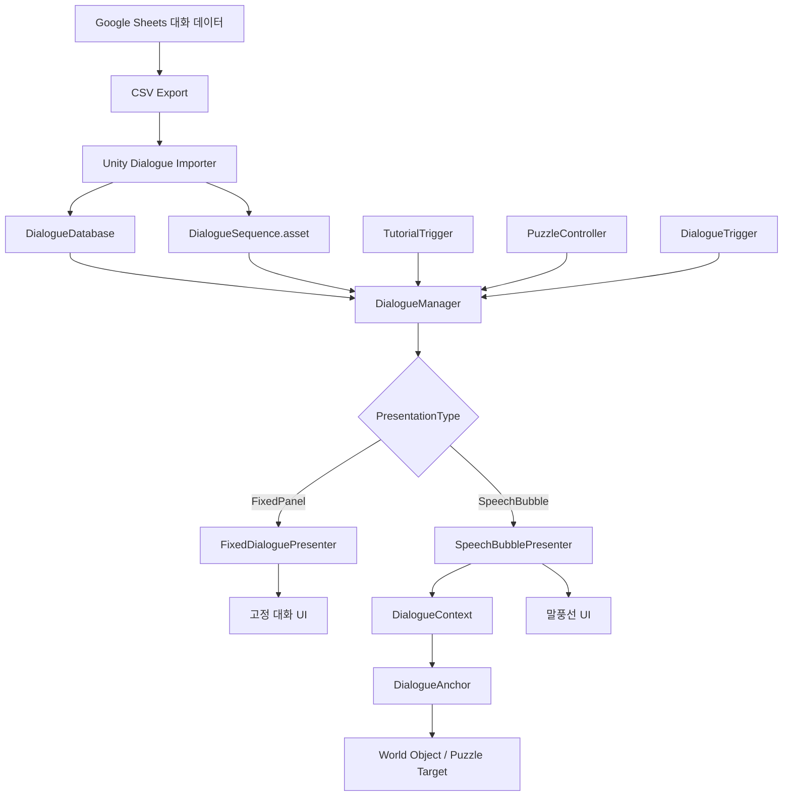
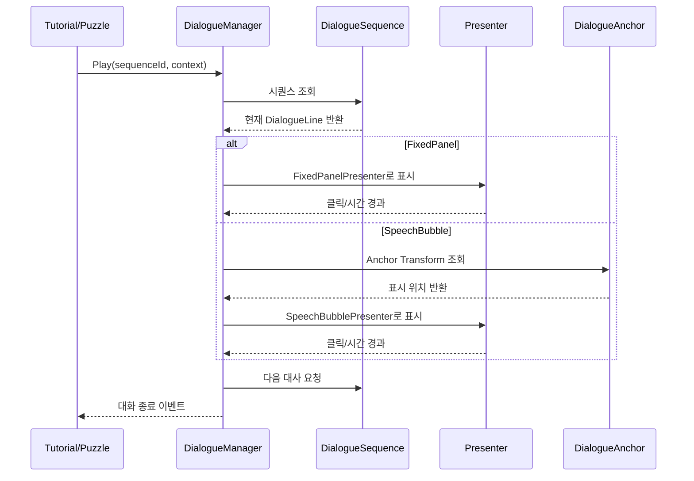

### 대화

1. 3D환경에서 팝업을 띄워서 대화하기
2. 특정 오브젝트 위에 말풍선으로 대화 띄우기
3. 퍼즐 플레이 중 특정 위치에 대화 띄우기

기존 단일 대화 데이터 구조를 4가지로 구분
1. Group
2. Dialogue Line
3. Anchor
4. Event

```mermaid
flowchart TD
    A[Google Sheets 대화 데이터] --> B[CSV Export]
    B --> C[Unity Dialogue Importer]
    C --> D[DialogueDatabase]
    C --> E[DialogueSequence.asset]

    D --> F[DialogueManager]
    E --> F

    G[TutorialTrigger] --> F
    H[PuzzleController] --> F
    I[DialogueTrigger] --> F

    F --> J{PresentationType}
    J -->|FixedPanel| K[FixedDialoguePresenter]
    J -->|SpeechBubble| L[SpeechBubblePresenter]

    L --> M[DialogueContext]
    M --> N[DialogueAnchor]
    N --> O[World Object / Puzzle Target]

    K --> P[고정 대화 UI]
    L --> Q[말풍선 UI]
```

```mermaid
sequenceDiagram
    participant T as Tutorial/Puzzle
    participant M as DialogueManager
    participant S as DialogueSequence
    participant P as Presenter
    participant A as DialogueAnchor

    T->>M: Play(sequenceId, context)
    M->>S: 시퀀스 조회
    S-->>M: 현재 DialogueLine 반환

    alt FixedPanel
        M->>P: FixedPanelPresenter로 표시
        P-->>M: 클릭/시간 경과
    else SpeechBubble
        M->>A: Anchor Transform 조회
        A-->>M: 표시 위치 반환
        M->>P: SpeechBubblePresenter로 표시
        P-->>M: 클릭/시간 경과
    end

    M->>S: 다음 대사 요청
    M-->>T: 대화 종료 이벤트
```

