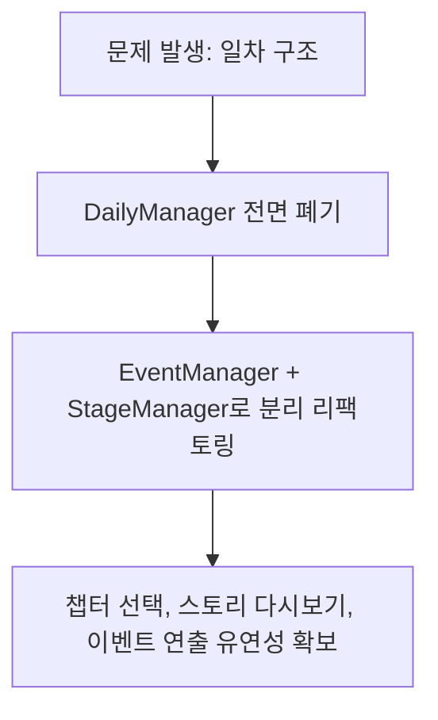

---

> **프로젝트**: Bridge-Alien (2.5D 캐주얼 물류 분류 & 육성 어드벤처)  
> **개발 기간**: 2024.10 ~ 2026.07 (약 1년 10개월, 총 750+ 커밋)  
> **역할**: 게임 클라이언트 & 시스템 프로그래밍  
> **기술 스택**: Unity 6, C#, Audiokinetic Wwise, Google Sheets API, Analytics Backend  

---

## 1. 프로젝트 요약
`외노자`는 외계 행성에서 지구로 온 주인공이 택배 물류 하차 작업을 수행하며 스탯을 육성하고 스토리를 풀어나가는 2.5D 캐주얼 어드벤처 게임이다.
초기 프로토타입 단계의 **'하차 + 배송' 미니게임 체제**에서 시작해, 플레이 재미와 완성도를 위해 **'하차 미니게임 심화 + 챕터 기반 스토리'로 변경**하고, 자체 레벨 디자인 툴(`StageEditor`) 제작, Wwise 사운드 엔진 연동, 백엔드 분석 클라이언트 구축을 거쳐 Unity 6 버전으로 마감했다.

---

## 2. What Went Well

### 1. 기획-개발 생산성을 위한 자체 툴 (StageEditor & Google Sheets)
* **StageEditor 개발**: 씬에 오브젝트를 일일이 배치하던 기존 방식을 버리고, 에디터 윈도우에서 상자 스폰 확률, 쿨타임, 트럭 배치를 GUI로 설정하고 즉시 인게임 테스트를 돌릴 수 있는 환경을 구축했다.
스테이지 에디터를 통해 스테이지 정보, 설정 값들을 세팅할 수 있도록 했다.
또한 게임 내 오브젝트 프리팹을 생성해서 기획자가 직접 세팅할 수 있도록 했다.
게임 플레이 씬과 테스트 씬을 독립적으로 구성하여 자유로운 테스트 환경을 구축했다.

* **원격 데이터 파이프라인**: 대사 스크립트와 밸런스 테이블을 구글 스프레드시트에서 파싱하도록 만들어, 코드 재빌드 없이 기획자가 밸런스를 조정할 수 있었다.

구글 시트에서 데이터를 가져와
SO 형태로 만들 수 있게 세팅했다.

* **성과**: 레벨 1개를 제작하고 검증하는 시간이 수 시간에서 수 분 단위로 단축되었으며, 팀원 간의 커뮤니케이션 비용이 줄었다.

### 2. 선택과 집중
* 내가 담당했던 하차 게임, 그 외 팀원 프로그래머가 담당했던 배송 게임이 있었지만 팀이 깨지면서 하나에 집중하기로 했다.
* 팀 회의를 통해 과감히 배송 모드를 덜어내고, **하차 게임의 기믹(냉각, 폐기, 반환, 콤보, 액티브 스킬 3종)을 고도화**하는 방향으로 결정했다.
* **성과**: 코어 루프가 명확해지며 게임플레이의 몰입도와 손맛이 크게 향상되었다.

### 3. 산업 표준 미들웨어(Wwise) 및 백엔드 텔레메트리 연동
* 단순 Unity Audio 대신 **Audiokinetic Wwise**를 도입하여 다이얼로그 독백/대화 BGM 전환, 발소리, 콤보 SFX 등을 이벤트 기반으로 정교하게 믹싱했다.
* 유저의 골드 소모처, 스킬 업그레이드 순서, 스테이지별 클리어 타임을 수집하는 **Analytics 클라이언트**를 구축하여 정량적 데이터 기반의 밸런스 수정을 가능하게 했다.
* Railway를 사용해서 PostgreSQL 데이터베이스를 설정하고 API를 세팅해서 배포했다.

---

## 3. What Went Wrong

### 1. 초기 시스템 설계의 유연성 부족 (경직된 '일차(Day)' 루프)
* **문제**: 초반에는 날짜가 순차적으로 흐르는 `DailyManager` (Day 1 ➔ Day 15) 구조로 개발했습니다. 그러나 이후 "특정 스테이지 다시하기", "스토리 다시보기", "자유로운 챕터 선택" 요구사항이 추가되자 기존 구조와 강하게 충돌했다.
* **원인**: 향후 추가될 수 있는 챕터 선택형 진행 방식을 초기 설계 단계에서 충분히 추상화하지 못했다. 

### 2. 2.5D 환경에서의 렌더링 소팅 & 모바일 조작감 이슈
* **문제**: 3D 공간에 2D 빌보드 스프라이트를 띄우는 특성상, 특정 각도에서 컨베이어 벨트 뒤로 상자가 파묻히거나 캐릭터 회전값이 초기화되지 않아 스프라이트가 뒤집히는 버그가 지속적으로 발생했다.
* 또한 모바일 가변 조이스틱이 플레이 도중 튀거나 터치 영역이 겹쳐 조작감이 떨어지는 피드백을 받았습다.

---

## 4. How We Overcame (극복 과정 / Action)

### 1. 이벤트 기반 아키텍처로의 대규모 리팩토링
* `DailyManager`를 폐기하고, 날짜 흐름과 무관하게 동작하는 **`EventManager`와 `StageManager` 체제**로 전면 리팩토링했다.
* 이로써 챕터별 해금, 스토리 다시보기, 특정 스테이지 독립 실행이 모두 깔끔하게 지원되는 유연한 상태 머신 구조를 완성했다.

### 2. 렌더링 뎁스 알고리즘 보정 및 고정 조이스틱 옵션화
* `SpriteBillboard`에 카메라 오프셋 보정과 Y-Sort 인터랙션 우선순위 계산식을 적용하여 소팅 뎁스 문제를 원천 차단했다.
* 가변 조이스틱 외에 모바일 유저들이 선호하는 **고정 조이스틱 옵션**을 추가하고, 상자 운반 시 근력 스탯에 따른 이동속도 감속 보정을 세밀하게 튜닝하여 쾌적한 조작감을 확보했다.

### 3. Unity 6 엔진 마이그레이션 완수
* 개발 후반부, 최신 렌더링 기능 및 성능 최적화를 위해 **Unity 6로 엔진 업그레이드**를 진행했습니다. 마이그레이션 과정에서 발생한 패키지 충돌 및 빌드 에러를 모두 트러블슈팅하여 최종 v0.1.0 빌드를 성공적으로 안정화했다.

---

## 5. Lessons Learned & Next Steps

1. **"코드가 아닌 툴을 만들어라"**:
   * 게임 개발에서 가장 큰 병목은 코드 작성이 아니라 기획-검증 루프에 있다는 것을 배웠다. 앞으로의 프로젝트에서도 기획자가 자율적으로 데이터를 다룰 수 있는 **에디터 툴과 파이프라인**을 설계하는 과정이 필요할 것이다.
1. **"과감하게 버릴 줄 아는 결단력"**:
   * 공들여 만든 배송 모드를 덜어내는 것은 아쉬웠지만, 하나의 코어 재미(하차)를 깊이 있게 만드는 것이 게임의 완성도를 결정짓는다는 것을 체감했다.
3. **"확장성을 고려한 초기 추상화"**:
   * 일차 시스템을 챕터 시스템으로 엎는 리팩토링을 겪으며, 비즈니스 로직과 데이터의 결합도를 낮추는 인터페이스 설계의 중요성을 다시 한 번 느꼈다.

