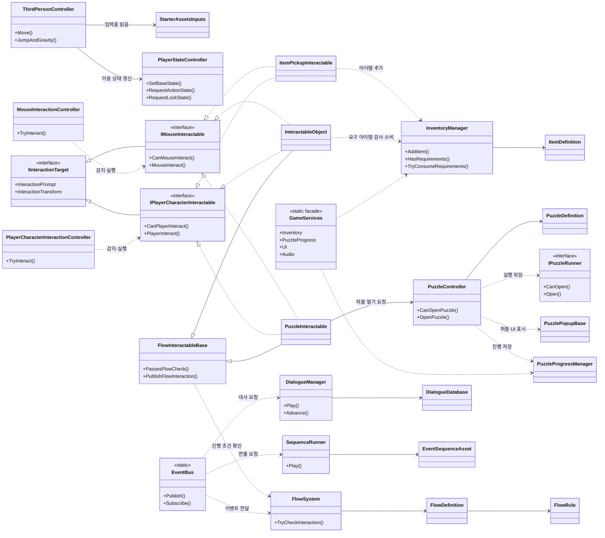
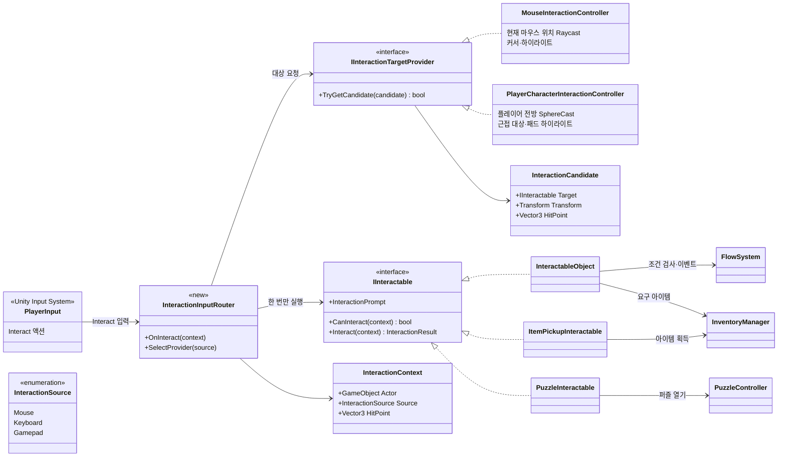

### 프로젝트 시작
`Boot`씬에서 전역 시스템을 만든 뒤 Title로 넘기는 구조
```
실행
→ Boot 씬
→ __Core 전역 오브젝ㅌ트 초기화, 유지
→ DataRegistry 초기화
→ Title 씬 비동기 로드
```

`CoreBootstrapper.cs`
Unity가 첫 씬을 로드한 직후 `Initialize()` 가 자동으로 호출된다.

```C#
[RuntimeInitializeOnLoadMethod(RuntimeInitializeLoadType.AfterSceneLoad)]
private static void Initialize()
{
	EnsureInitialized();
}
```

`__Core`라는 오브젝트를 찾거나 만들고, `DontDestoryOnLoad`로 씬 전환 후에도 남도록 한다.

```C#
 public static void EnsureInitialized()
{
	if (initialized)
	{
		return;
	}

	GameManager gameManager = Object.FindAnyObjectByType<GameManager>();
	GameObject core = ResolveCoreHost(gameManager);
	EnsureCoreServices(core);
	RemoveLegacySettingsManagers(core);

	if (gameManager == null)
	{
		core.AddComponent<GameManager>();
	}

	Object.DontDestroyOnLoad(core);
	initialized = true;
}
```

그 아래에 씬 전환, 데이터, UI, 오디오, 인벤토리, 대화, 퍼즐 진행, 설정 등의 전역 서비스를 보장한다.
```C#
private static void EnsureCoreServices(GameObject core)
    {
        EnsureComponent<SceneFlowManager>(core, "SceneFlow");
        EnsureComponent<DataRegistry>(core, "Data");
        EnsureComponent<ResourceManager>(core, "Resources");
        EnsureComponent<UIManager>(core, "UI");
        EnsureComponent<CursorManager>(core, "UI");
        EnsureComponent<AudioManager>(core, "Audio");
        EnsureComponent<InventoryManager>(core, "Inventory");
        EnsureComponent<AlbumCollection>(core, "Album");
        EnsureComponent<PuzzleProgressManager>(core, "Progress");
        EnsureComponent<DialogueManager>(core, "Dialogue");
        EnsureComponent<SequenceRunner>(core, "Sequence");
        EnsureComponent<SettingsManager>(core, "Settings");
    }
```
이미 있는 서비스는 그대로 사용하고 없는 경우에 런타임에서 추가한다.

```C#
private static T EnsureComponent<T>(GameObject core, string systemName) where T : Component
{
	T existingComponent = core.GetComponentInChildren<T>(true);
	if (existingComponent != null)
	{
		return existingComponent;
	}

	GameObject systemObject = EnsureSystemObject(core, systemName);
	return systemObject.AddComponent<T>();
}

private static GameObject EnsureSystemObject(GameObject core, string systemName)
{
	Transform systemTransform = core.transform.Find(systemName);
	if (systemTransform != null)
	{
		return systemTransform.gameObject;
	}

	GameObject systemObject = new GameObject(systemName);
	systemObject.transform.SetParent(core.transform);
	return systemObject;
}
```

`GameManagers.cs`
시스템을 이용해서 게임의 현재 상태를 결정하는 곳
```C#
private void Awake()
{
	if (Instance != null && Instance != this)
	{
		Destroy(gameObject);
		return;
	}

	Instance = this;
	DontDestroyOnLoad(gameObject);
	CoreBootstrapper.EnsureServices(gameObject);
	GameServices.ValidateCoreServices();
	GameServices.Data.Initialize();
	SetState(initialState);
}
```
`Awake`에서 싱글턴 등록, 전역 서비스 준비, 검증, 데이터 초기화를 진행한다.
```C#
private IEnumerator Start()
{
	yield return null;
	
	...
}
```
한 프레임을 기다렸다가 Start()가 돌아가도록 함.
`Awake()`에서 `__Core`와 전역 서비스를 만들고 데이터를 초기화한 뒤, 다른 컴포넌트의 초기화도 진행될 시간을 준 다음 Title 전환을 시작하려는 의도


`SceneFlowManager.cs`
전환 중 상태, 페이드, UI, 오디오를 함께 관리하는 화면 흐름 담당자

```
씬 전환 요청
→ IsLoading 검사
→ GameState를 Cutscene으로 전환
→ 검은 페이드 인
→ LoadSceneAsync 시작, 씬 활성화 보류
→ 로딩 오버레이 표시 후 페이드 아웃
→ progress가 0.9에 도달할 때까지 대기
→ 다시 검은 페이드 인
→ 새 씬 활성화
→ GameState, BGM 적용, 로딩 UI 숨김
→ 검은 페이드 아웃
```

---

### ClassDiagram



입력 구조가 키보드 마우스로 분리 되어있고, PC에서만 적용 가능함.
-> Input System을 활용해서 패드도 바인딩할 수 있도록 구조 변경



---
