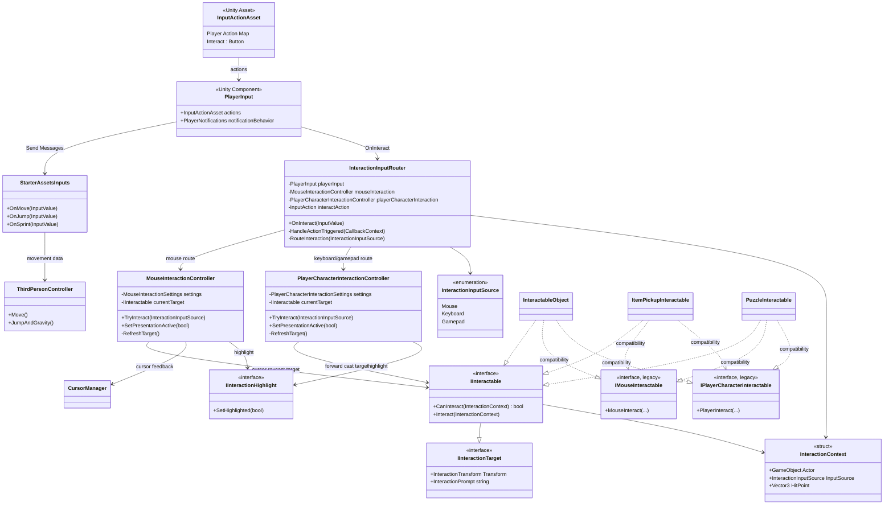
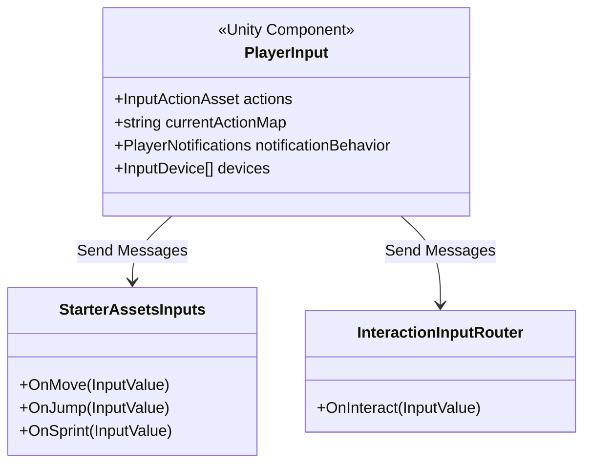
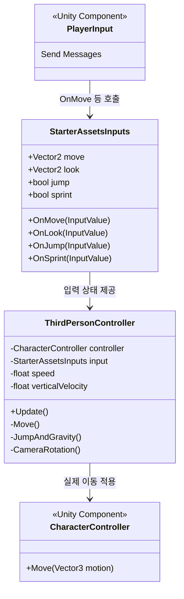
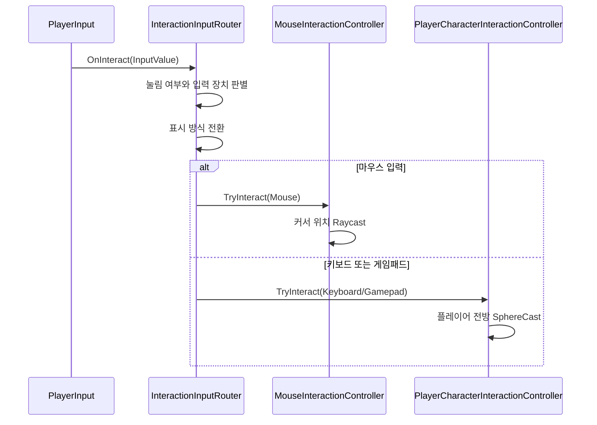

---

### 1. `StarterAssets.inputactions`

```
StarterAssets.inputactions
└── Player Action Map
    ├── Move
    ├── Jump
    ├── Sprint
    └── Interact
        ├── Keyboard / e
        ├── Mouse / leftButton
        └── Gamepad / buttonWest
```
액션을 바인딩해서 코드에서는 `Interact` 발생 -> 상호작용 처리를 하도록

### 2. `PlayerInput`


|항목|현재 값|의미|
|---|---|---|
|Actions|`StarterAssets.inputactions`|사용할 입력 정의|
|Action Map|`Player`|플레이 중 활성화되는 액션 묶음|
|Notification Behavior|`Send Messages`|액션 발생 시 같은 오브젝트의 `On액션명` 메서드 호출|
|위치|`PlayerRobot/Robot`|이동·상호작용 컴포넌트와 같은 오브젝트|
Move Action이 발생하면 해당 컴포넌트가 붙은 오브젝트에서 OnMove가 호출된다.

### 3. `StarterAssetsInputs` → `ThirdPersonController`


```
PlayerInput 이벤트
    ↓
StarterAssetsInputs.move = (x, y)
    ↓
ThirdPersonController.Update()
    ↓
Move()
    ├─ 걷기 / 달리기 목표 속도 결정
    ├─ 카메라 기준 이동 방향 계산
    ├─ 부드러운 회전 계산
    └─ CharacterController.Move() 호출
```

`Move()`
1. `sprint` 상태에 따라 걷기 속도 또는 달리기 속도를 선택한다.
2. `move` 벡터를 카메라 방향 기준의 월드 좌표 이동 방향으로 바꾼다.
3. 목표 회전값으로 부드럽게 회전한다.
4. `CharacterController.Move()`로 수평 이동을 적용한다.

```
OnJump(true)
    ↓
StarterAssetsInputs.jump = true
    ↓
JumpAndGravity()
    ├─ 땅 위인지 확인
    ├─ 점프 속도 부여
    ├─ 중력 누적
    └─ 수직 이동값을 CharacterController에 적용
```

### 4. `InteractionInputRouter`


Router가 굳이 필요한가?
마우스 입력과 키보드 입력으로 상호작용되는 오브젝트와 액션은 어차피 구분되어 있는데

```mermaid
classDiagram
    direction LR

    class StarterAssetsInputActions {
        <<Input Action Asset>>
        Player Map
        Move : Value
        Look : Value
        Jump : Button
        Sprint : PassThrough
        PointerInteract : Button
        ForwardInteract : PassThrough
    }

    class PlayerInput {
        <<Unity Component>>
        notificationBehavior : Send Messages
        currentActionMap : Player
    }

    class StarterAssetsInputs {
        +OnMove(InputValue)
        +OnLook(InputValue)
        +OnJump(InputValue)
        +OnSprint(InputValue)
        move : Vector2
        look : Vector2
        jump : bool
        sprint : bool
    }

    class ThirdPersonController {
        +Move()
        +JumpAndGravity()
    }

    class PointerInteractionController {
        +OnPointerInteract(InputValue)
        -RefreshTarget()
        -TryPointerInteract()
        -currentTarget : IPointerInteractable
    }

    class ForwardInteractionController {
        +OnForwardInteract(InputValue)
        -forwardInteractionHeld : bool
        -RefreshForwardMovableTarget()
        -UpdateGrabMoveState()
        -EndForwardInteraction()
    }

    class ForwardInteractionSettings {
        forwardProbeDistance : float
        forwardProbeRadius : float
        forwardProbeAngle : float
    }

    class IPointerInteractable {
        <<interface>>
        +CanPointerInteract(actor)
        +PointerInteract(actor)
    }

    class IForwardInteractable {
        <<interface>>
        +CanForwardInteract(actor)
        +BeginForwardInteraction(actor)
        +MoveDuringForwardInteraction(actor)
        +EndForwardInteraction(actor)
    }

    class PuzzleInteractable
    class ItemPickupInteractable
    class MovableObject

    StarterAssetsInputActions --> PlayerInput : action map
    PlayerInput --> StarterAssetsInputs : OnMove / Look / Jump / Sprint
    PlayerInput --> PointerInteractionController : OnPointerInteract
    PlayerInput --> ForwardInteractionController : OnForwardInteract

    StarterAssetsInputs --> ThirdPersonController : movement input
    StarterAssetsInputs --> ForwardInteractionController : move input
    ForwardInteractionController --> ForwardInteractionSettings : range settings

    PointerInteractionController --> IPointerInteractable : detects / invokes
    ForwardInteractionController --> IForwardInteractable : forward detects / invokes
    PointerInteractionController --> ForwardInteractionController : player transform reference

    PuzzleInteractable ..|> IPointerInteractable
    ItemPickupInteractable ..|> IPointerInteractable
    MovableObject ..|> IForwardInteractable
```



구조 변경 

| 구분       | 기존                                                                                                 | 현재                                                              |
| -------- | -------------------------------------------------------------------------------------------------- | --------------------------------------------------------------- |
| 입력 분기    | 일반 상호작용 입력을 라우터가 해석                                                                                | `PointerInteract`, `ForwardInteract` 액션이 처음부터 분리                |
| 컨트롤러     | `MouseInteractionController` + `PlayerCharacterInteractionController` + `PlayerGrabMoveController` | `PointerInteractionController` + `ForwardInteractionController` |
| 대상 인터페이스 | 범용 `IInteractable` 계열과 테스트용 대상 혼재                                                                  | `IPointerInteractable`, `IForwardInteractable`                  |
| 퍼즐·아이템   | 입력 종류와의 관계가 느슨함                                                                                    | 포인터 상호작용만 구현                                                    |
| 밀기 오브젝트  | 잡기/이동 전용 로직과 입력이 결합                                                                                | 전방 상호작용만 구현                                                     |
| 입력 유지    | Shift 등 특정 키를 코드가 직접 해석                                                                            | Input Actions가 키·패드를 담당, 컨트롤러는 액션 상태만 받음                        |

