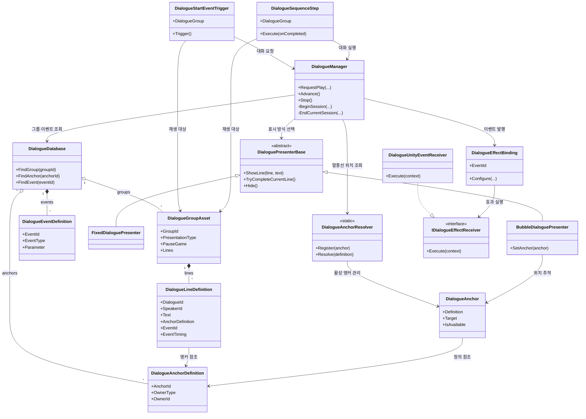

다이얼로그 관련 이벤트 추가
- DialogueStartRequestedEvent
- DialogueStartedEvent
- DialogueEndedEvent

### 1. `DialogueManager`

- 생성·유지: `CoreBootstrapper`가 `__Core`에 매니저를 추가하고 씬 전환에도 유지합니다. 중복 인스턴스는 `Awake`에서 제거됩니다.
- 재생 정책: `Queue`, `Interrupt`, `IgnoreIfPlaying`을 지원하며, 각 세션에 ID를 부여해 종료 이벤트를 구분합니다.
- 진행: 타이핑 중 Advance는 즉시 문장을 완성하고, 이후 Advance는 이전 줄의 `After` 이벤트 → 다음 줄의 `Before` 이벤트 → 화면 표시 순서로 진행합니다.
- UI: 그룹의 표시 타입에 따라 고정 패널 또는 말풍선 Presenter를 선택하고, 없으면 Resources 프리팹을 동적으로 만듭니다.
- 입력: 플레이 중 `Dialogue/Advance` 액션 맵으로 전환하고 종료 시 이전 맵을 복원합니다. 현재 Space, 마우스 좌클릭, 게임패드 South 버튼이 연결돼 있습니다.
- 일시정지: `PauseGame` 그룹은 기존 게임 상태를 저장한 뒤 정지하고, 종료 시 원래 상태로 되돌립니다.
- 테스트: 큐 완료 후 다음 대화 시작, 인터럽트 시 종료 사유와 교체 세션 시작은 EditMode 테스트가 있습니다.

### 2. `DialogueDatabase`
- 런타임 DB는 `DialogueManager`가 `Resources/Data/Dialogue/DialogueDatabase`에서 로드합니다.
- DB는 대화 그룹 14개, 앵커 4개, 이벤트 8개를 보유합니다.
- DB의 그룹·앵커 참조는 실제 에셋과 모두 일치합니다. 누락되거나 참조되지 않는 그룹·앵커는 없습니다.
- `GroupId` 14개, `AnchorId` 4개, `EventId` 8개, `DialogueId` 57개가 모두 중복 없이 고유합니다.
- 대사 줄이 참조하는 이벤트 7개는 모두 DB에 정의돼 있습니다. `open_chapter_door`만 아직 대사에서 사용되지 않는 정의입니다. 이는 향후 콘텐츠용일 수 있어 오류는 아닙니다.
- Google Sheet 임포터도 런타임 DB와 실제 그룹 에셋 폴더를 갱신하도록 연결돼 있습니다.

### 3. `DialogueGroupAsset` · `DialogueLineDefinition` 리뷰
- 14개 그룹, 57개 문장입니다.
- 모든 문장의 `GroupId`가 부모 그룹 ID와 일치합니다.
- 모든 그룹의 `Order`가 엄격하게 오름차순입니다. `DialogueManager`는 리스트 순서대로 재생하고, Sheet 임포터가 `Order` 기준으로 정렬합니다.
- 고정 패널 그룹은 13개, 말풍선 그룹은 1개입니다.
- 말풍선 그룹 `ch01.room.curtain`의 7개 문장은 모두 앵커를 가집니다.
- `PauseGame`은 지원하지만 현재 활성화한 그룹은 없습니다. 기능 미사용 상태이지 오류는 아닙니다.

### 4. Presenter 계층 리뷰
- 두 프리팹 모두 `root`, `CanvasGroup`, 화자·대사 TMP 텍스트, Advance 버튼, `UIPresentation`을 직접 참조합니다.
- 타이핑과 UI 입·퇴장은 `unscaledDeltaTime`을 사용하므로, `PauseGame` 대화에도 멈추지 않습니다.
- Advance는 타이핑 중 문장을 즉시 완성하고, 완료된 경우에만 다음 문장으로 넘깁니다.
- 말풍선은 활성 앵커를 매 프레임 추적하며, 앵커가 없으면 기본 위치 `(0, -100)`으로 표시됩니다.
- 현재 `PopupDefault` 프리셋의 위치 오프셋은 0이라, 말풍선의 앵커 위치 갱신과 입장 애니메이션이 충돌하지 않습니다.

### 5.`DialogueAnchor` · `DialogueAnchorResolver`

결론: 현재 말풍선 대화 한 건은 올바르게 연결돼 있습니다. 다만 프리팹의 미설정 앵커 하나와 에디터 도구의 DB 선택 방식은 정리 대상입니다.

- `DialogueAnchor`는 활성화될 때 등록되고 비활성화될 때 해제됩니다. 대상 Transform을 지정하지 않으면 자기 Transform을 기본 대상으로 사용합니다.
- Resolver는 같은 `DialogueAnchorDefinition`을 가진 활성 앵커만 반환하므로, 문자열 ID 비교보다 참조 안정성이 좋습니다.
- 현재 말풍선 그룹은 `ch01.room.curtain` 하나이며, 7개 문장이 모두 `CH01_Curtain_UI_Target` 앵커를 참조합니다.
- 실제 `CurtainPuzzlePopup`에도 동일한 정의를 가진 앵커가 하나 배치돼 있어, 현재 콘텐츠 경로는 일치합니다.

### 6. `DialogueEffectBinding`

실행 흐름은 다음과 같습니다.
`DialogueManager` → `DialogueEventTriggeredEvent` 발행 → `DialogueEffectBinding`이 ID 일치 여부 확인 → Receiver 또는 EventSequence 실행

확인 결과:
- `DialogueEffectBinding`과 `DialogueUnityEventReceiver`가 씬·프리팹에 직렬화된 사례가 없습니다.
- `DialogueEventTriggeredEvent`를 구독하는 런타임 코드도 현재 `DialogueEffectBinding` 외에는 없습니다.
- 따라서 `show_tutorial_move`, `get_handkerchief`, `enable_player_move` 같은 대사 이벤트는 발행되지만, 현재 상태에서는 아무 효과도 실행하지 않습니다.
- Binding 코드는 이벤트 ID 일치, 비어 있는 Receiver, 잘못된 Receiver 타입을 잘 검증합니다.
- 단위 테스트도 일치 이벤트 전달과 불일치 이벤트 무시를 검증합니다. 다만 테스트는 런타임 씬이 아닌 메모리상 Binding을 직접 구성합니다.
- 이후 CH1에서 대화 중 오브젝트 active나 이동 등이 필요한 경우 Binding해서 사용합니다.

### 7. `DialogueStartEventTrigger` · `DialogueSequenceStep`
- `DialogueStartEventTrigger`는 그룹과 정책을 담은 시작 요청 이벤트만 발행합니다. 현재 `CurtainPuzzlePopup` 한 곳에 배치돼 있으며, 시작 시 `ch01.room.curtain`을 `Queue` 정책으로 재생합니다.
- `DialogueSequenceStep`은 대화를 요청한 뒤, **자신이 시작한 세션 ID**의 `DialogueEndedEvent`를 받으면 시퀀스를 다음 단계로 진행시킵니다.
- 취소·인터럽트·정상 완료를 구분하지 않고 모두 “단계 완료”로 처리합니다. 취소 시 시퀀스도 중단돼야 하는 콘텐츠라면 정책을 추가해야 합니다.