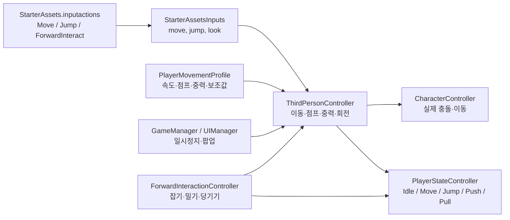

## 1. 입력에서 이동까지

`StarterAssetsInputs`는 Input System 이벤트를 단순한 값으로 바꿔 보관합니다.

```C#
public Vector2 move;
public bool jump;

public void OnMove(InputValue value)
{
    MoveInput(value.Get<Vector2>());
}

public void OnJump(InputValue value)
{
    JumpInput(value.isPressed);
}
```

`ThirdPersonController`는 매 프레임 이 값을 사용합니다.

```C#
private void Update()
{
    GroundedCheck();
    UpdateJumpAssistance();
    JumpAndGravity();
    Move();
}
```

먼저 지면을 확인하고, 점프 입력을 버퍼링한 뒤 중력·점프를 계산하고 마지막으로 이동합니다. 이전처럼 점프 전에 이전 프레임의 지면 상태를 쓰지 않도록 순서를 잡아둔 상태입니다.


## 2. 이동 처리

```C#
float targetSpeed = ResolvedMoveSpeed * Mathf.Max(0.0f, SpeedMultiplier);
bool movementInputBlocked = IsMovementInputBlocked();
Vector2 moveInput = movementInputBlocked ? Vector2.zero : _input.move;
```

`ResolvedMoveSpeed`는 `PlayerMovementProfile`이 지정되어 있으면 프로필 값을, 없으면 기존 `MoveSpeed` 필드 값을 사용합니다.

```C#
private float ResolvedMoveSpeed =>
    movementProfile != null ? movementProfile.MoveSpeed : MoveSpeed;
```

카메라 기준으로 이동 방향을 만들고, 회전은 부드럽게 보간합니다.

```C#
targetRotation = Mathf.Atan2(inputDirection.x, inputDirection.z)
    * Mathf.Rad2Deg + _mainCamera.transform.eulerAngles.y;

transform.rotation = Quaternion.Euler(0.0f, rotation, 0.0f);
```

최종 이동은 수평 속도와 수직 속도를 합쳐 `CharacterController.Move()`로 적용합니다.

```C#
_controller.Move(
    targetDirection.normalized * (_speed * Time.deltaTime) +
    new Vector3(0.0f, _verticalVelocity, 0.0f) * Time.deltaTime);
```

팝업 또는 일시정지 중에는 수평 입력만 막습니다. 중력 이동은 유지하므로 공중에서 팝업을 열어도 캐릭터가 떠 있지 않습니다.


## 3. 점프 처리

점프 입력은 즉시 사라지지 않고 버퍼 시간 동안 유지됩니다.

```C#
if (_input != null && _input.jump)
{
    _jumpBufferDelta = ResolvedJumpBufferTime;
    _input.jump = false;
}
```

지면에 있을 때는 코요테 타임을 다시 충전합니다.

```C#
if (Grounded)
{
    _coyoteTimeDelta = ResolvedCoyoteTime;
}
```

두 보조 시간이 남아 있고, 쿨다운이 끝났을 때만 점프합니다.

```C#
if (movementInputBlocked ||
    _jumpBufferDelta <= 0.0f ||
    _coyoteTimeDelta <= 0.0f ||
    _jumpTimeoutDelta > 0.0f)
{
    return;
}

_verticalVelocity =
    Mathf.Sqrt(ResolvedJumpHeight * -2.0f * ResolvedGravity);
```

중력과 낙하 속도 제한은 다음과 같습니다.

```C#
_verticalVelocity = Mathf.Max(
    _verticalVelocity + ResolvedGravity * Time.deltaTime,
    -terminalVelocity);
```

기본 프로필 값은 이동 `0.5`, 점프 높이 `0.2`, 중력 `-15`, 코요테·버퍼 시간 각 `0.1초`입니다. TestScene은 체감 확인을 위해 이동 속도만 `3`인 테스트 프로필을 씁니다.


## 4. 잡기 상호작용 제약

`ForwardInteractionController`는 더 이상 속도·회전·축 제한을 각각 직접 만지지 않습니다. 잡기 상태를 한 번에 적용하거나 해제합니다.

```C#
movementController.ApplyGrabMovementConstraint(
    GrabbedMoveSpeedMultiplier,
    GetGrabAxisDirection(),
    MoveAxisInputThreshold);
```

```C#
public void ApplyGrabMovementConstraint(
    float speedMultiplier,
    Vector3 axis,
    float inputThreshold)
{
    SpeedMultiplier = Mathf.Max(0.0f, speedMultiplier);
    LockMoveRotation = true;
    SetMoveAxisConstraint(axis, inputThreshold);
}
```

잡기가 끝나면 반드시 원래 상태로 복구합니다.

```C#
public void ClearGrabMovementConstraint()
{
    SpeedMultiplier = 1.0f;
    LockMoveRotation = false;
    ClearMoveAxisConstraint();
}
```

따라서 잡은 상태에서는 보통 속도가 `0.5배`가 되고, 캐릭터가 물체 방향을 유지하며 해당 축으로만 밀거나 당길 수 있습니다.

## 5. 상태 표시

`PlayerStateController`는 실제 물리를 처리하지 않고, 애니메이션·디버그 표시용 상태를 결정합니다.

```
Lock 상태 > Jump 상태 > Push/Pull 행동 상태 > Idle/Move 기본 상태
```

즉 공중에서는 `Jump`가 우선이고, 지상에서 물체를 잡으면 `Push` 또는 `Pull`, 그 외에는 입력 유무에 따라 `Idle` 또는 `Move`가 됩니다.


---

원형 콜라이더 사용해서 지면을 체크하고 있기 때문에, 벽을 바닥으로 감지하게 된다.


Step Offset 으로 블럭 높이 넘어감
